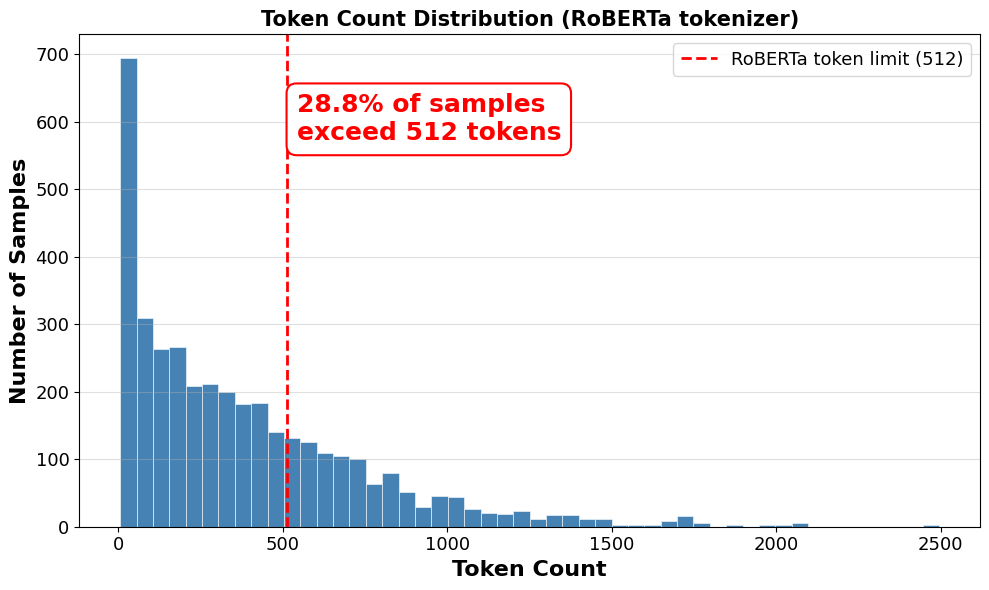
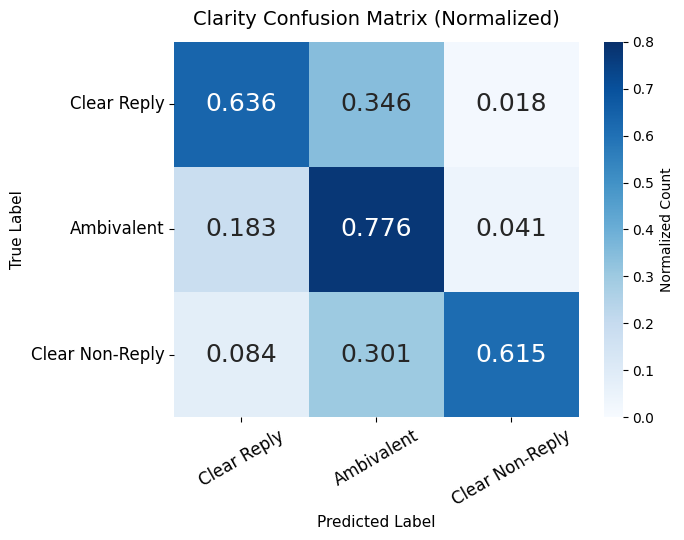
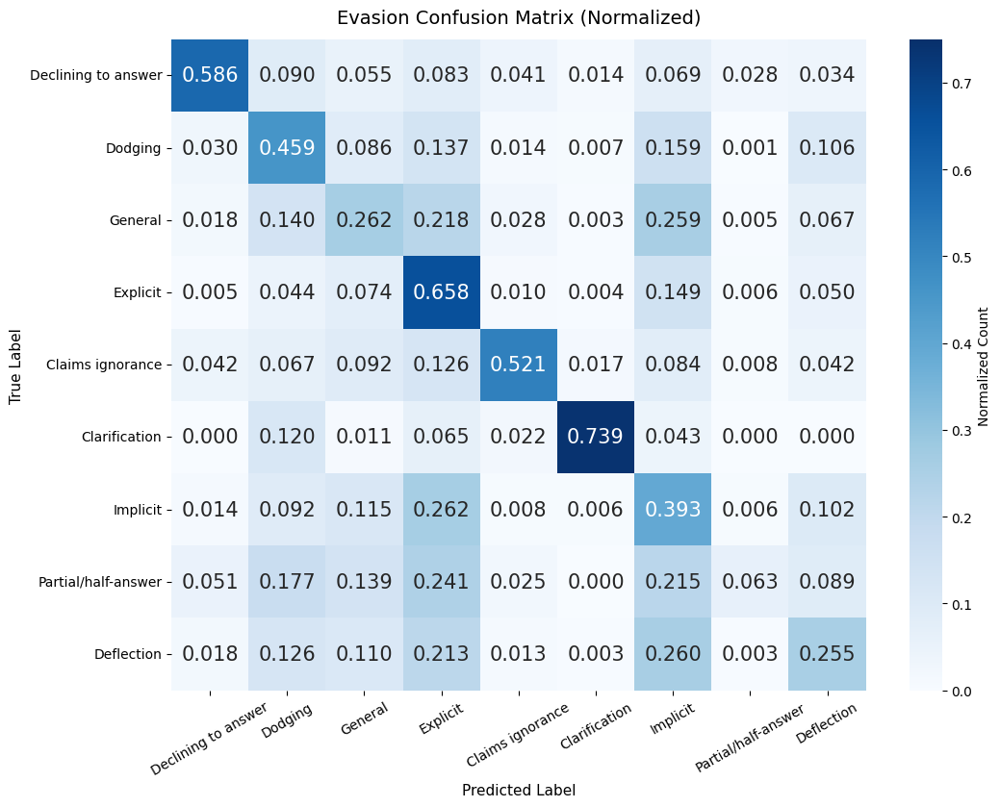

# Multi-Head RoBERTa with Chunking for Long-Context Evasion Detection

This repository contains our system for **SemEval-2026 Task 6 (CLARITY: Unmasking Political Question Evasions)**.
Our paper based on this implementation was accepted to the SemEval-2026 workshop (co-located with ACL 2026) and is available at https://arxiv.org/abs/2604.26375.

- [Shared Task Page](https://konstantinosftw.github.io/CLARITY-SemEval-2026/)
- [HuggingFace Dataset](https://huggingface.co/datasets/ailsntua/QEvasion)

## Task Overview

The CLARITY task requires classifying English political interview question--answer pairs along two dimensions:

- **Subtask 1 (Clarity):** 3-way classification into *Clear Reply*, *Ambivalent*, or *Clear Non-Reply*.
- **Subtask 2 (Evasion):** 9-way classification into fine-grained evasion strategies (*Explicit*, *Dodging*, *Implicit*, *General*, *Deflection*, *Partial/half-answer*, *Clarification*, *Claims ignorance*, *Declining to answer*).

The dataset comprises 3,756 QA pairs from 287 White House interview transcripts (2006--2023), with 3,448 training and 308 development instances. Label distributions are substantially skewed, and inter-annotator agreement is moderate (Fleiss κ = 0.64 for Subtask 1, κ = 0.48 for Subtask 2). Performance is evaluated using Macro-F1.

## System Overview

### Hierarchical Input Processing

Political responses frequently exceed the 512-token limit of standard Transformer encoders. Since evasion cues may appear anywhere in the response, naïve truncation risks discarding critical evidence. We address this with an overlapping sliding-window chunking strategy:

1. Each question--answer pair is formatted as `Question: {Q}\nAnswer: {A}` and tokenized without truncation.
2. The token sequence is segmented into overlapping windows of length $L = 512$ with stride $S = 256$.
3. Each chunk is encoded independently by a shared RoBERTa-large encoder; we extract the hidden state at position 0 of each chunk.
4. Chunk representations are aggregated via element-wise Max-Pooling into a single response-level vector $v \in \mathbb{R}^{1024}$.

Max-Pooling preserves the strongest feature activations across all chunks, capturing localized evasion cues regardless of their position in the response.



*Distribution of token counts for the concatenated question--answer input in the CLARITY dataset. The vertical red line marks the 512-token limit of standard RoBERTa models.*

### Multi-Task Classification Heads

The pooled vector $v$ is shared by both subtasks. After dropout ($p = 0.1$), two task-specific linear heads produce predictions:

- A 3-way Clarity classifier
- A 9-way Evasion classifier

Both heads are trained jointly using a combined cross-entropy loss:

$$\mathcal{L} = \mathcal{L}_{\text{clarity}} + \mathcal{L}_{\text{evasion}}$$

No class-weighted loss, focal loss, or label smoothing is used. The coarser clarity signal acts as an effective regularizer for the more difficult evasion task.

### Training and Inference

- 7-fold stratified cross-validation, stratified by Subtask 1 labels to preserve class proportions.
- Checkpoint selection maximizes the combined score $\text{F1}_{\text{comb}} = \frac{1}{2}(\text{F1}_{\text{clarity}} + \text{F1}_{\text{evasion}})$.
- At inference time, all 7 fold models are ensembled by averaging predicted class probabilities and taking argmax.

## Experimental Setup

### Hyperparameters

| Hyperparameter | Value |
| :--- | :--- |
| Optimizer | AdamW (weight decay 0.01) |
| Learning rate | 1e-5 (10% warmup) |
| Batch size | 8 |
| Max epochs | 15 (early stopping patience = 3) |
| Classifier dropout | 0.1 |
| Gradient clipping | max norm 1.0 |
| Precision | BF16 mixed precision |
| Gradient checkpointing | enabled |
| Random seed | 42 (base; per-fold offset) |

### Hardware

All experiments were conducted on a single NVIDIA RTX 3090 (24 GB VRAM). Training the full 7-fold ensemble takes approximately 5 hours.

### Dependencies

- `torch` (>=2.2.2)
- `transformers` (>=4.40.0)
- `datasets` (>=2.19.0)
- `accelerate` (>=0.30.0)
- `scikit-learn` (>=1.4.2)
- `numpy` (>=1.26.4)
- `pandas` (>=2.2.2)
- `protobuf` (==3.20.3)
- `sentencepiece` (>=0.2.0)

Install all dependencies:

```bash
pip install -r requirements.txt
```

## Results

### Official Test Set

| Subtask | Rank | Macro-F1 |
| :--- | :---: | :---: |
| Subtask 1 (Clarity) | 11 / 41 | 0.80 |
| Subtask 2 (Evasion) | 11 / 33 | 0.51 |

### Ablation Studies (7-fold CV, mean ± std)

**Pooling Strategy**

| Pooling Method | Clarity F1 | Evasion F1 |
| :--- | :---: | :---: |
| First Chunk Only | 0.67 ± 0.01 | 0.42 ± 0.01 |
| Mean Pooling | 0.68 ± 0.02 | 0.43 ± 0.02 |
| **Max-Pooling (Ours)** | **0.70 ± 0.02** | **0.45 ± 0.02** |

**Multi-Task Learning**

| Training Objective | Clarity F1 | Evasion F1 |
| :--- | :---: | :---: |
| Single-task (Clarity only) | **0.70 ± 0.02** | -- |
| Single-task (Evasion only) | -- | 0.42 ± 0.01 |
| **Multi-task (Ours)** | 0.70 ± 0.02 | **0.45 ± 0.02** |

**Ensemble Size**

| Ensemble Size | Clarity F1 | Evasion F1 |
| :--- | :---: | :---: |
| 3-fold | 0.66 ± 0.01 | 0.42 ± 0.02 |
| 5-fold | 0.68 ± 0.02 | 0.43 ± 0.03 |
| **7-fold (Ours)** | **0.70 ± 0.02** | **0.45 ± 0.02** |

### Error Analysis

**Subtask 1 (Clarity)**

The model correctly identifies ~78% of *Ambivalent* samples but misclassifies ~35% of *Clear Replies* and ~30% of *Clear Non-Replies* as *Ambivalent*, which acts as a majority-class sink for borderline cases.



**Subtask 2 (Evasion)**

Recall is lowest for *Partial/half-answer* (0.0%), with predictions scattered across multiple classes. Strategies with strong lexical cues achieve substantially higher recall: *Clarification* (~74%), *Declining to answer* (~59%), and *Claims ignorance* (~52%).



## Future Work

Several directions remain open for improving performance:

- Targeted data augmentation for minority evasion classes to address the severe class imbalance in Subtask 2.
- Cost-sensitive training objectives (e.g., class-weighted loss, focal loss) to reduce the tendency of *Ambivalent* to act as a majority-class sink in Subtask 1.
- Explicit question--answer interaction modeling via cross-attention between the question and the response, motivated by the fact that certain fine-grained evasion strategies are definitionally relational and may not be captured by simple concatenation.
- Larger ensemble sizes and alternative aggregation strategies beyond average-probability ensembling.

## Repository Structure

```
Clarity/
├── main.tex                       # Paper source
├── requirements.txt               # Python dependencies
├── notebooks/
│   ├── final/                     # Final submitted system
│   │   └── train_roberta_maxpool_multihead_kfold.ipynb
│   ├── ablation/                  # Paper ablations
│   ├── baselines/                 # Baseline experiments
│   └── experiments/               # Exploratory experiments
├── src/
│   ├── evaluate_predictions.py
│   ├── feature_extractor.py
│   └── process_dataset.py
├── data/
│   ├── predictions/               # Model predictions
│   └── augmentated_datasets/      # Augmented training data
├── official_test_dataset/         # Official evaluation data
├── images/                        
```

